# Application Flow

Detailed flowcharts showing how AutoApply processes each job from discovery to submission.

## High-Level Pipeline

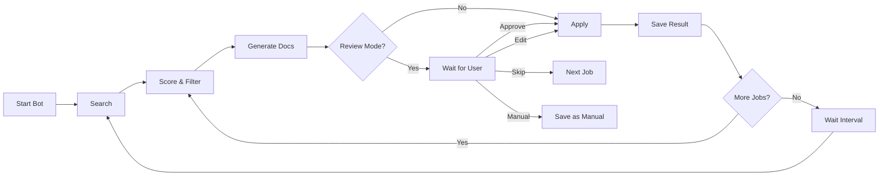

---

## 1. Bot Startup

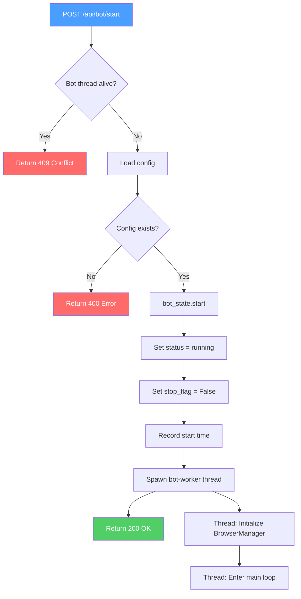

### Scheduler Auto-Start

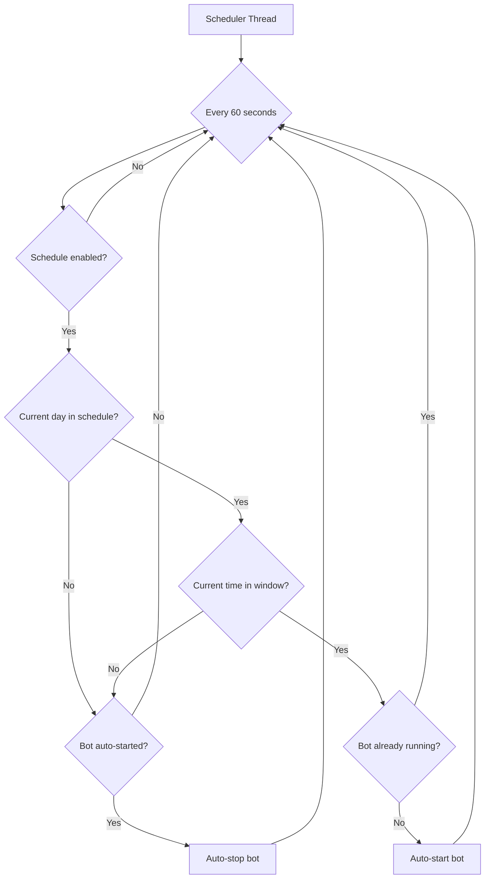

---

## 2. Main Bot Loop

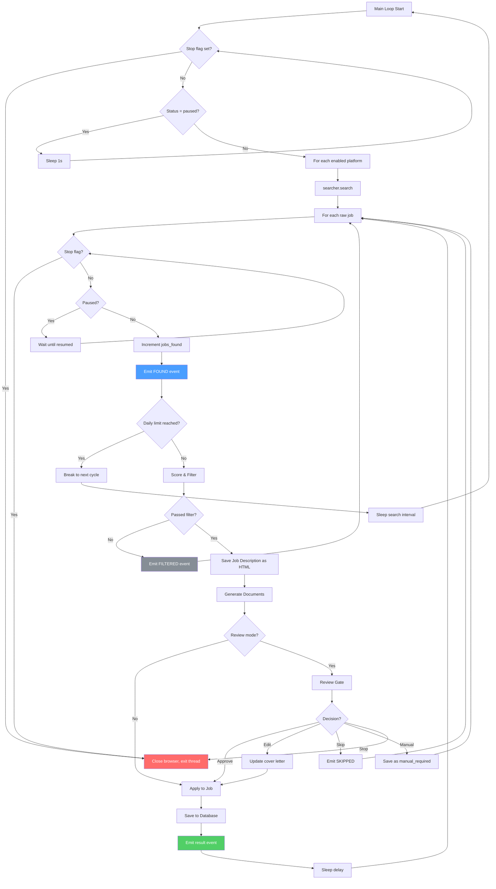

---

## 3. Job Scoring & Filtering

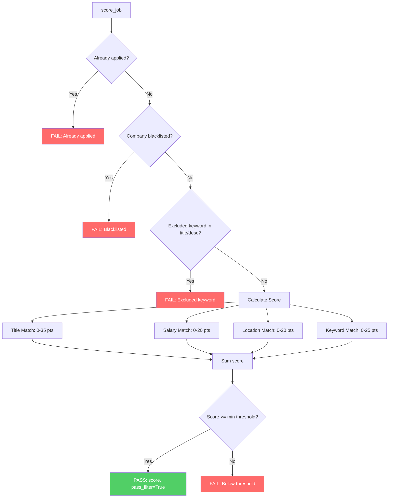

### Scoring Breakdown

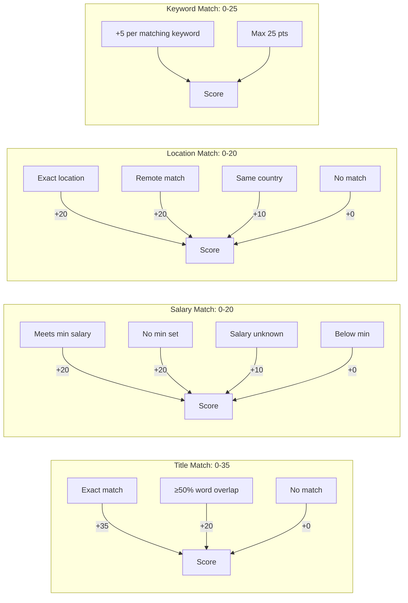

---

## 4. Document Generation

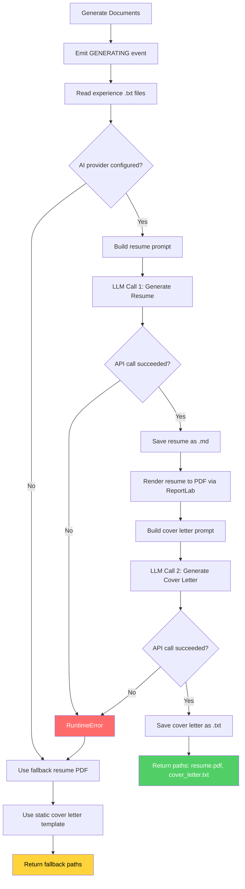

### LLM API Call Routing

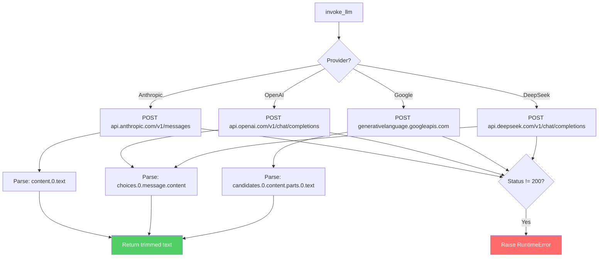

---

## 5. Review Gate

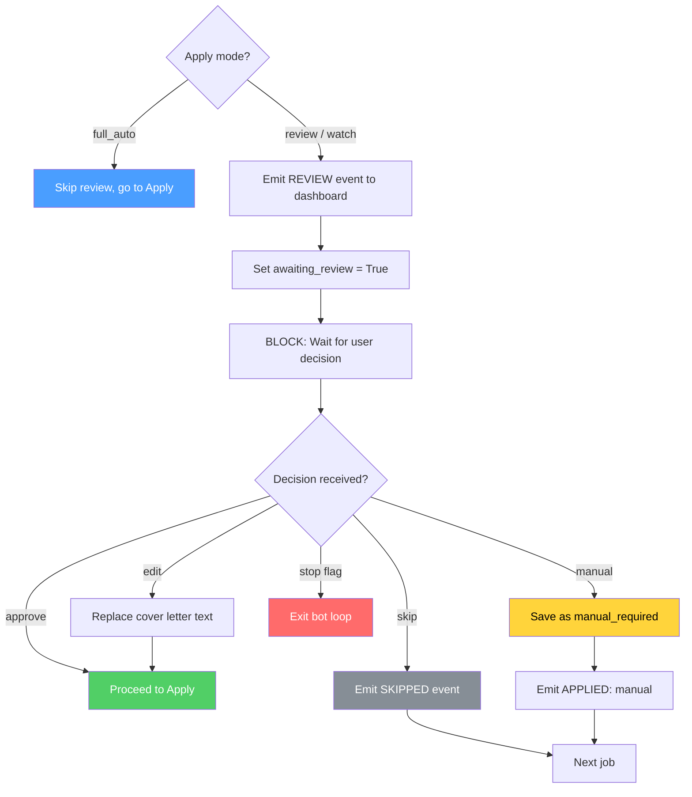

---

## 6. Apply to Job

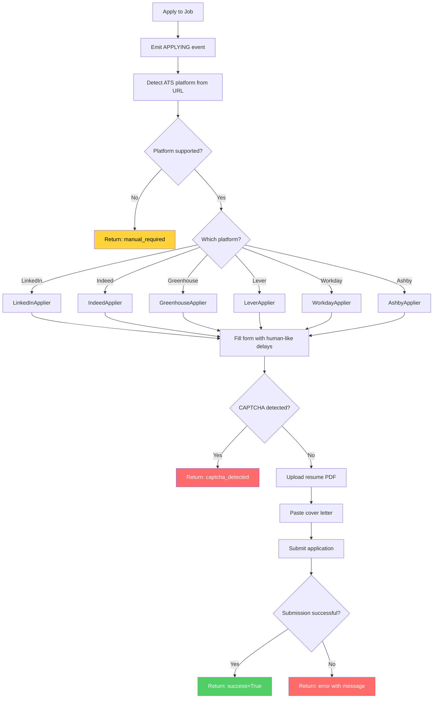

### ATS Detection

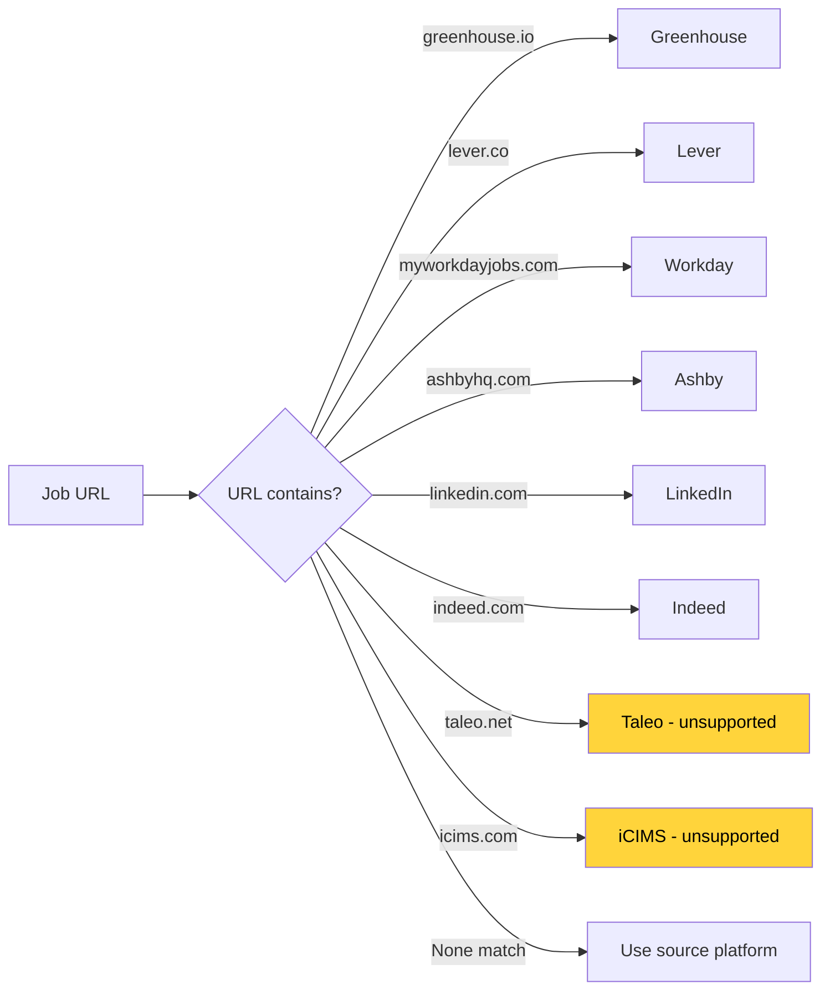

---

## 7. Save & Emit Result

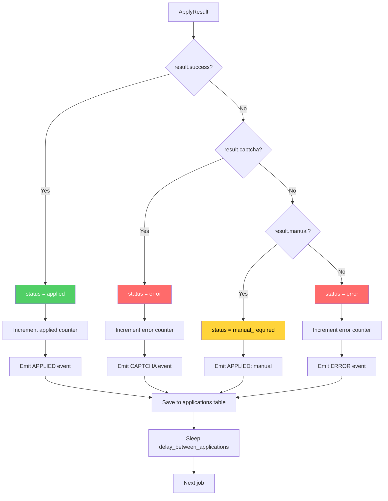

---

## 8. Bot State Machine

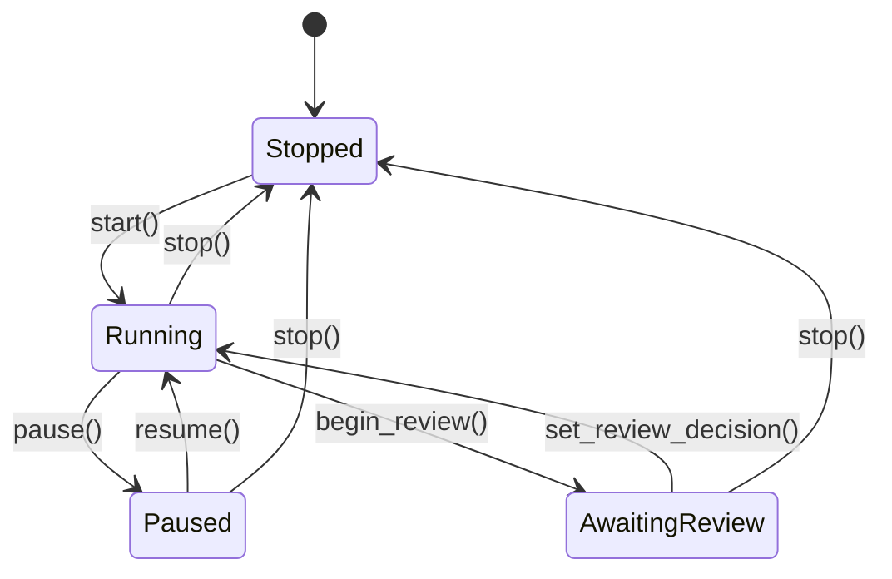

### State Fields

```
BotState
├── status: "stopped" | "paused" | "running"
├── stop_flag: bool
├── jobs_found_today: int
├── applied_today: int
├── errors_today: int
├── start_time: datetime
├── awaiting_review: bool
├── review_decision: str | None
└── review_edits: str | None
```

---

## 9. SocketIO Event Flow

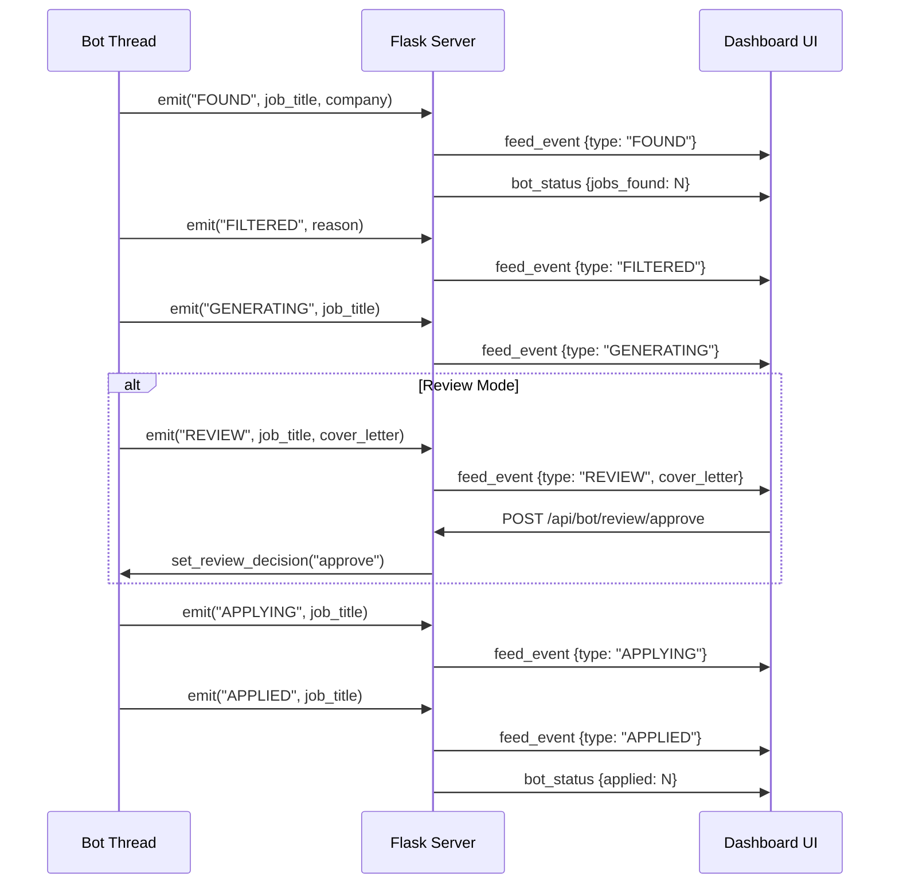

---

## 10. Error Handling

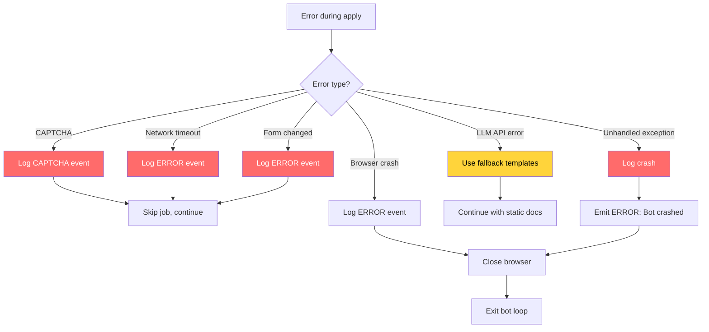
